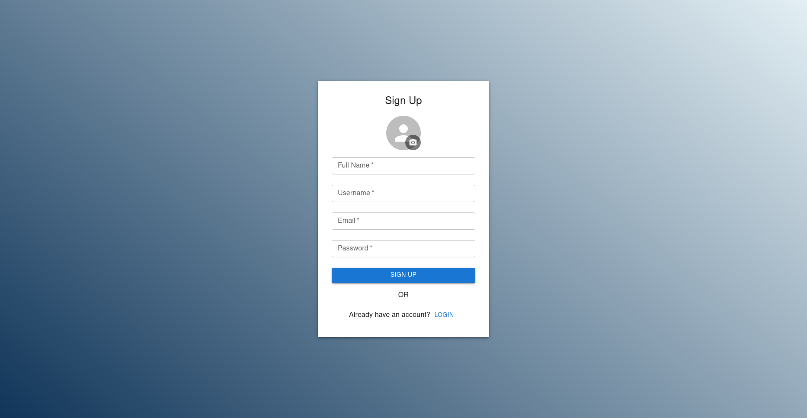
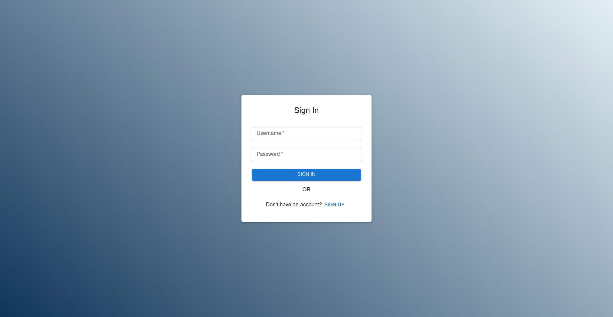
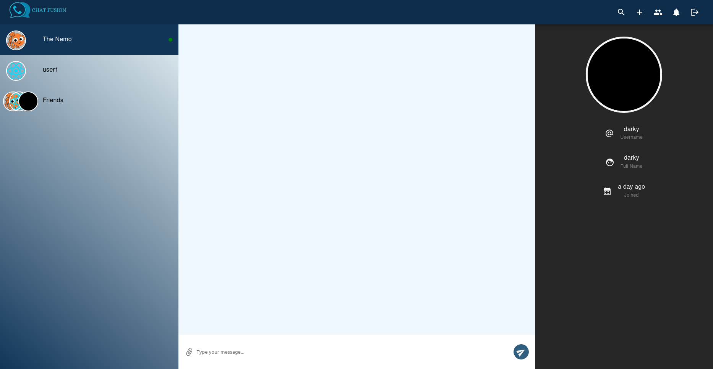
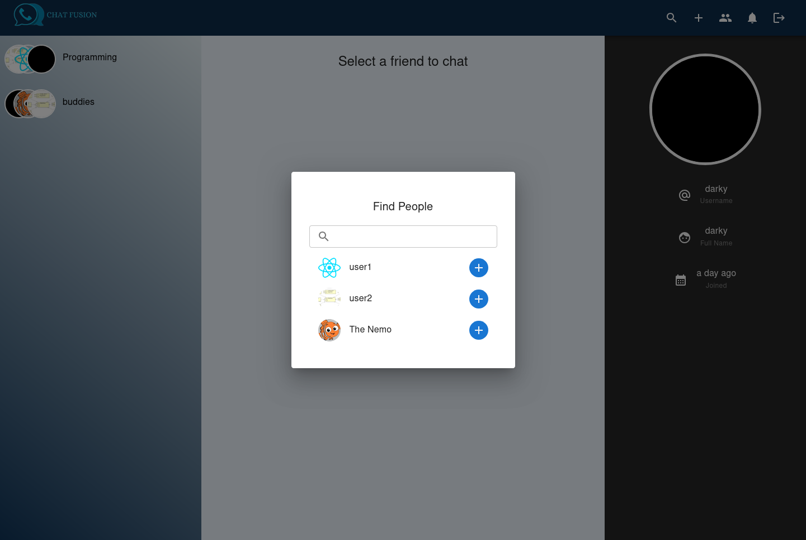
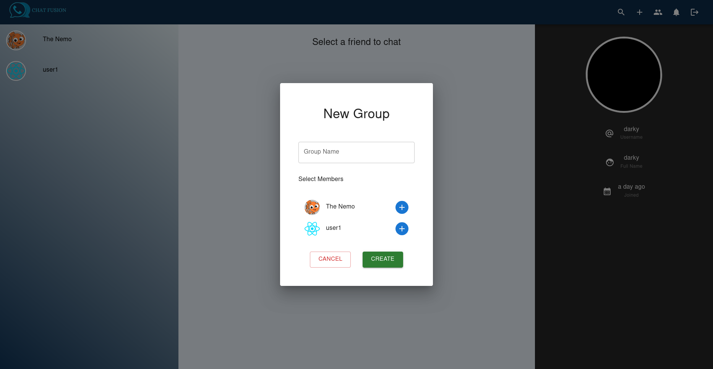
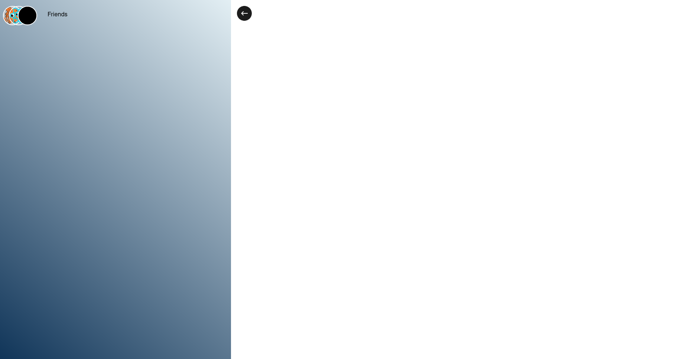
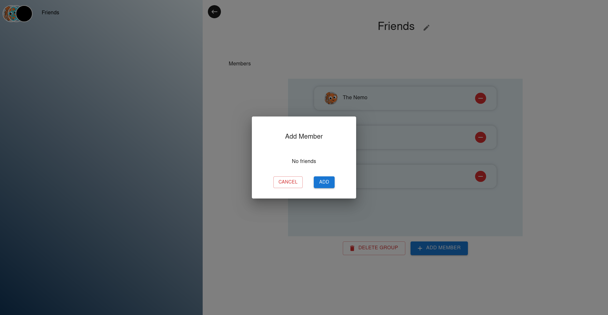

# Chat Fusion

A real-time chat application built using the MERN stack (MongoDB, Express, React, Node.js) with TypeScript. This project was inspired by a tutorial from 6 Pack Programmer, but with TypeScript instead of JavaScript.

**Test User**
- username: user1
- password: 123456

## Features

1. Real-time messaging
2. User authentication and authorization
3. Friend requests and management
4. Online/offline status
5. Typing indicators
6. Responsive design

## Screenshots

## Tech Stack

1. Frontend: React, React Router Dom, Redux Toolkit, Socket.IO
2. Styling: Material UI
3. Backend: Node.js, Express, TypeScript, MongoDB, Mongoose, JWT for authentication, Socket.IO
